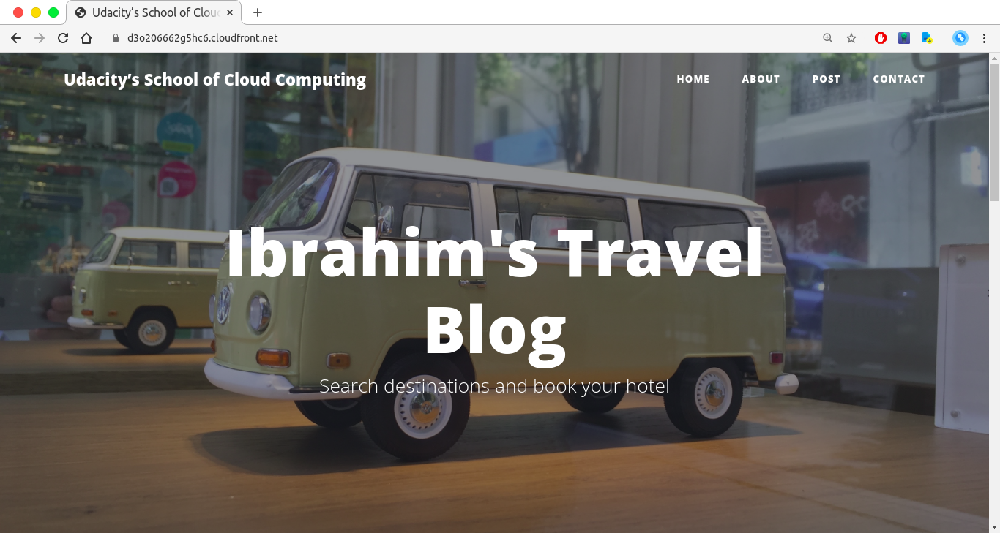
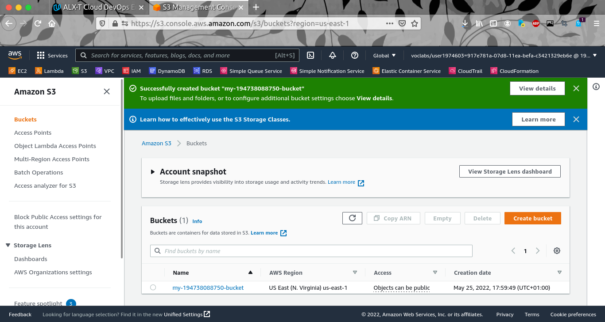
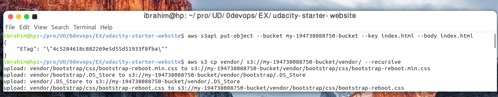
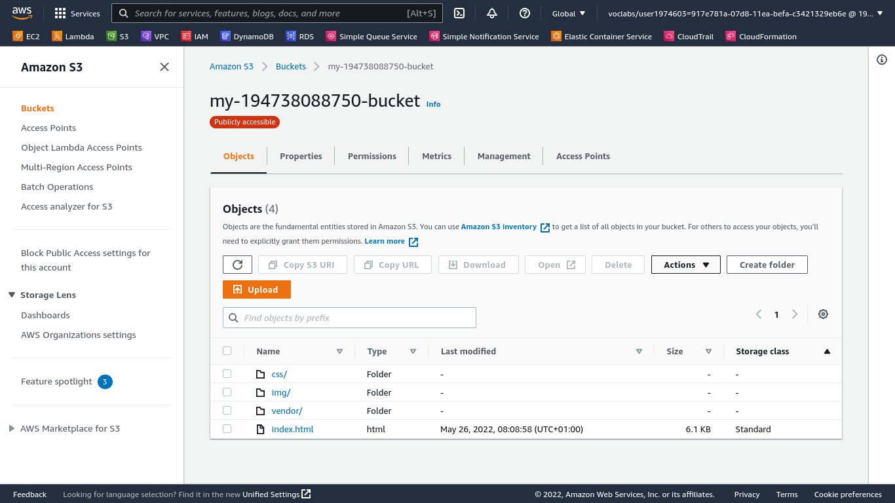
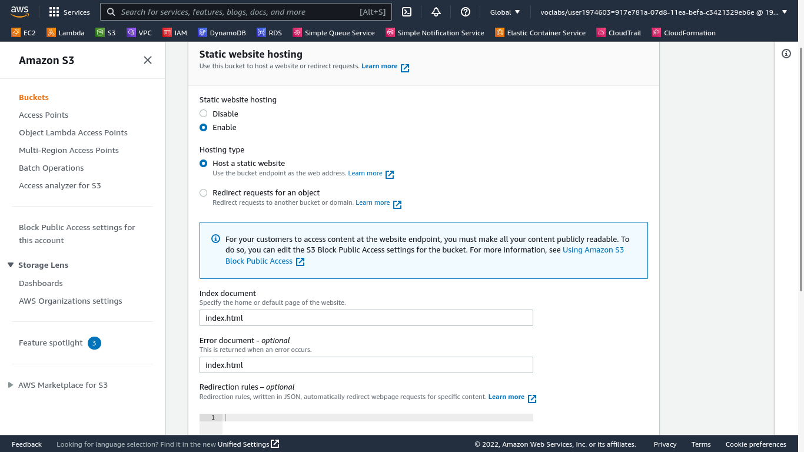
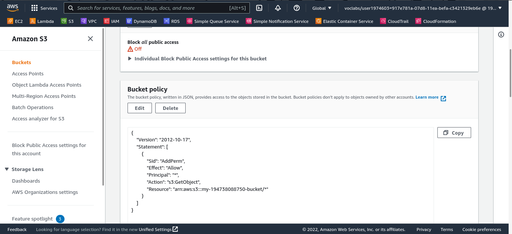
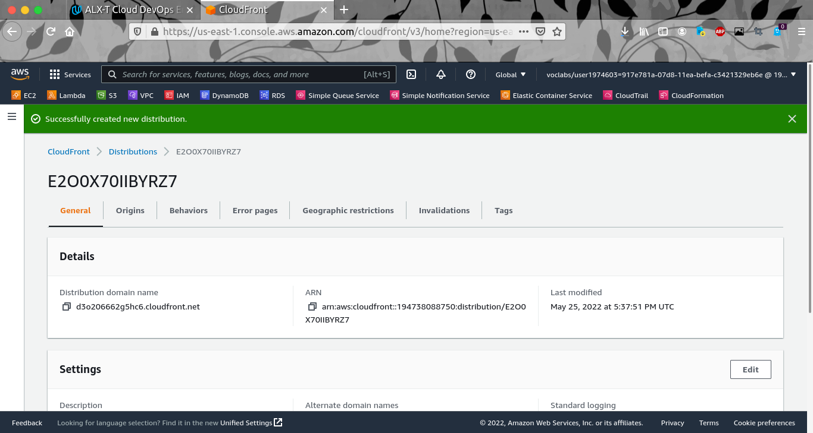
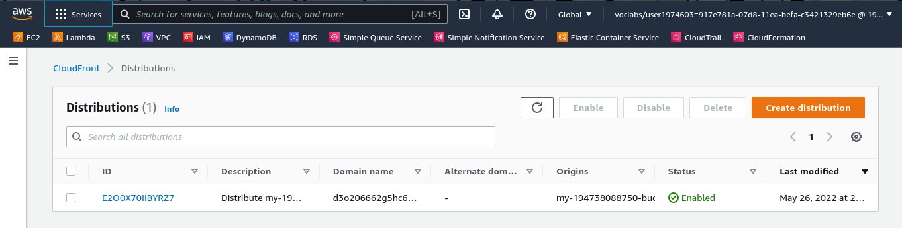
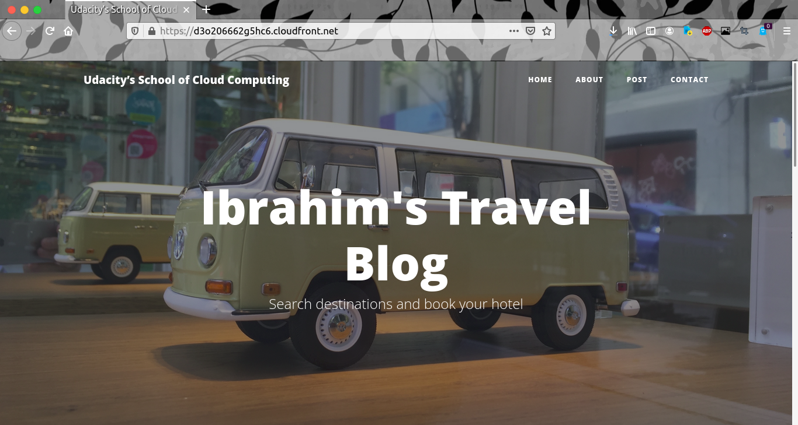

# Deploy Static Website on AWS

## Introduction
The cloud is perfect for hosting static websites that only include HTML, CSS, and JavaScript files that require no server-side processing. This project has two major intentions to implement:

    1. Hosting a static website on S3 and
    2. Accessing the cached website pages using CloudFront content delivery network (CDN) service.

## Project Files

|File/Directory |Description|
|---------------|----------|
|index.html | The Index document for the website.|
|/img | The background image file for the website.|
|/vendor | Bootssrap CSS framework, Font, and JavaScript libraries needed for the website to function|
|/css | CSS files for the website.|

## Implementation

### 1. Create S3 Bucket
Navigate to the “AWS Management Console” page, type “S3” in the “Find Services” box and then select S3 > Create Bucket

### 2. Upload Website files to the S3 bucket
Click the “Add files” and “Add folder” button, and upload the files/folder content from local computer to the S3 bucket. \
Or use the AWS CLI to upload the file and folders

Verify the uploaded files

### 3. Configure S3 bucket to support static website hosting

Go to the Properties tab and then scroll down to edit the Static website hosting section > Properties tab -> Edit the Static website hosting section

### 4. Allow public access to the bucket using IAM policy

Click on the “Permissions” tab > Permissions tab. Click on the Edit button to edit the bucket policy

### 5. Distribute website via Cloudfront
Select “Services” from the top left corner and enter “cloud front” in the “Find a service by name or feature” text box and select “CloudFront”.
From the CloudFront dashboard, click “Create Distribution” and complete the creation process

### 6. Web Browser Access
We can now access our static website via these endpoints

http://my-194738088750-bucket.s3-website.us-east-1.amazonaws.com

https://d3o206662g5hc6.cloudfront.net

Access the bucket object via its S3 object URL e.g: 
https://my-194738088750-bucket.s3.amazonaws.com/index.html

## Resources:

[https://docs.aws.amazon.com/AmazonS3/latest/userguide/Welcome.html](https://docs.aws.amazon.com/AmazonS3/latest/userguide/Welcome.html)

[https://docs.aws.amazon.com/AmazonCloudFront/latest/DeveloperGuide/Introduction.html](https://docs.aws.amazon.com/AmazonCloudFront/latest/DeveloperGuide/Introduction.html)

